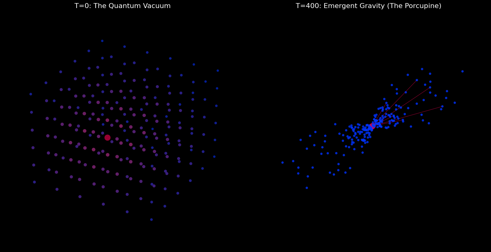

# QLSV v3.7: Gravity as Graph Computation



> **"Spacetime is just the User Interface; Information is the Source Code."**

NOTE: The code in simulation.py is an updated version with respect to the code in the manuscript and the pdf!

## 🌌 Overview

**QLSV (Quantum Local State Vector)** is a candidate framework for Quantum Gravity that redefines physical reality as the output of a quantum computation occurring on a Tensor Network ($Q$).

Instead of assuming a pre-existing spacetime background, QLSV posits that geometry ($S$) emerges via the thermodynamic minimization of **Geometric Tension**—the discrepancy between where particles *are* physically and where their entanglement says they *should be*.

This repository contains the **Official v3.7 Manuscript** (LaTeX/PDF) and the **Python Proof-of-Concept** simulation that numerically validates the theory.

## 🚀 Key Theoretical Innovations

### 1. Gravity as Entropic Attraction
We derive gravity not as a fundamental force, but as an emergent result of the **Relational Update Law**:
$$L''_{ij}(t) = -C \cdot (L_{ij}(t) + \lambda \ln(\mathcal{I}_{ij}))$$
Matter (knots of entanglement) pulls the graph inward to minimize the distance between highly entangled nodes.

### 2. The "Zero FPS" Singularity
Classical General Relativity breaks down at a Black Hole singularity (infinities). QLSV replaces this with a computational limit. A singularity is a region where graph complexity exceeds the universe's processing bandwidth ($\Omega$).
* **Result:** The simulation hangs. A Black Hole is a region running at **0 Frames Per Second**.

### 3. Time Dilation as "Lag"
We derive Gravitational Time Dilation as **Computational Latency**. Regions of high mass (high node density) require more processing cycles to update than the vacuum.
* **Prediction:** Local clocks tick slower near mass because the "Zipper" (the update mechanism) lags under the load.

### 4. Constants from Pixels
We mathematically recover the fundamental constants of nature from the graph's properties:
* **Speed of Light ($c$):** The Grid Speed ($\lambda \times \Omega$).
* **Gravitational Constant ($G$):** The Elasticity of the vacuum graph.
* **Planck's Constant ($\hbar$):** The Action Cost of a single bit update.

## 📂 Repository Structure

* `QLSV_v3.7_Manuscript.tex` - The full academic white paper (LaTeX source).
* `simulation.py` - The Python engine simulating the Relational Update Law.
* `qlsv_simulation.png` - Visual output of the emergence of a gravity well.

## 💻 Running the Simulation

The included Python script (`simulation.py`) simulates the evolution of a 2D hexagonal vacuum lattice when a "Mass" (entanglement knot) is introduced.

### Prerequisites
```bash
pip install networkx matplotlib numpy
